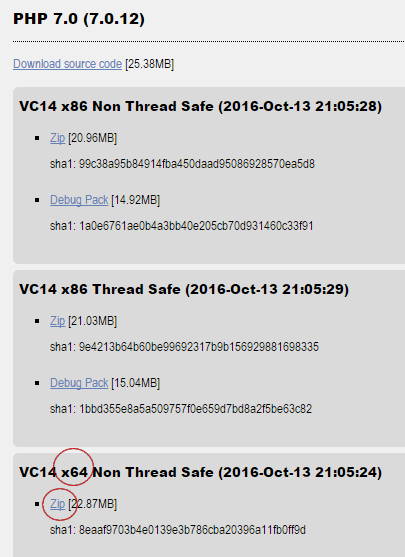
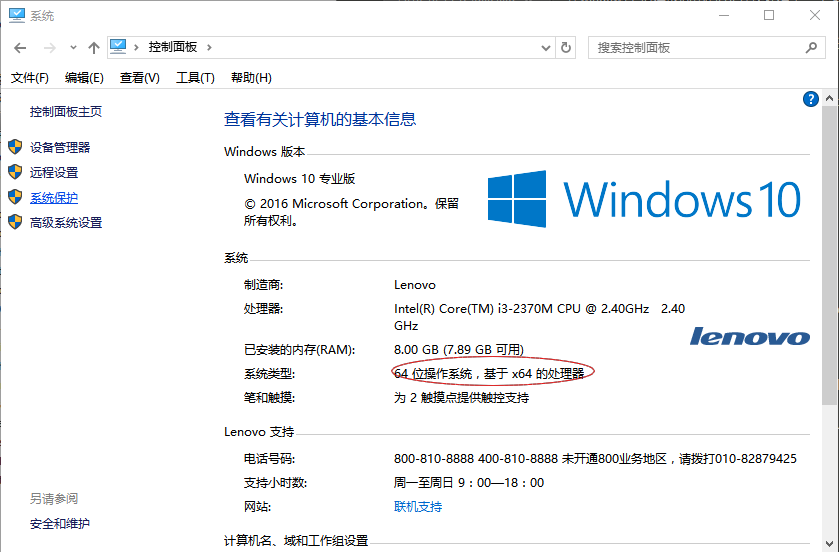

---
title:敏捷学习PHP（一）在windows环境下安装PHP 7
image:src/lpa/setup-php-7-windows.jpg
---

和在ubutntu直接apt-get相比，在windows下安装PHP还是稍显麻烦。大致步骤如下：

1. 在PHP官网下载zip压缩包并解压
2. 创建php.ini配置文件
3. 设置环境变量
4. 安装VC Redist
6. 启动cli-Server服务并运行phpinfo()

##在PHP官网下载zip压缩包并解压

到这里下载PHP在windows下的压缩包：http://windows.php.net/download/

php7有多个文件提供下载，包括`x86/x64`和`Non Thread Safe/Thread Safe`两对组合的四个选择。



其中Non Thread Safe/Thread Safe（非线程安全/线程安全）在开发阶段不用考虑，选择任意一个即可。

而`x86/x64`要看你的计算机cpu和操作系统是什么类型。如果是32位选择x86，如果是64位选择x64。如果你不知道，可以进入`控制面板-系统`查看，能够看到如下的显示：



这说明你的适合下载x64的版本。

将zip压缩包下载后，解压到任意目录，比如`c:\php`。注意文件要直接压缩到该目录下，通过`c:\php\php.exe`能够访问到php。

##创建php.ini配置文件

将php所在目录的`php.ini-development`文件复制一份，更名为`php.ini`。

这个文件是php的配置文件，暂时不需要修改文件内容。

##设置环境变量

为了在任意路径下方便的访问php，我们要将php目录设置到环境变量中。环境变量的设置在`控制面板-系统-高级系统设置-环境变量-用户环境变量`，其中找到`path`项点击`编辑`按钮，如果没有path项则点击`新建`按钮。将php所在目录如c:\php加入到path变量中。

这时可以通过`win-r`，输入cmd，打开命令行窗口，在任意路径下运行`php -v`，如果能显示出正确的版本信息，就安装成功了。

```
>php -v
PHP 7.0.11 (cli) (built: Sep 13 2016 15:37:04) ( NTS )
Copyright (c) 1997-2016 The PHP Group
Zend Engine v3.0.0, Copyright (c) 1998-2016 Zend Technologies
```

但如果报错，提示没有vc redist，就需要安装VC Redist。

##安装VC Redist

VC Redist是微软VC++的运行环境，因为PHP在windows下的版本是通过VC编译的，因此要安装该软件。

下载地址是：
https://www.microsoft.com/zh-CN/download/details.aspx?id=48145

下载后按照默认预设安装即可。

##启动cli-Server服务并运行phpinfo()

php最佳用途是做web服务端程序，因此php自5.4版本增加了cli-server，提供了简单的http服务。通过使用cli-server，我们可以不同安装apache/nginx就能运行php程序了。

启动cli-server很简单，只要在程序所在目录运行：

```
php -S localhost:8080
```

注意几点：
* -S 参数是大写
* localhost是本机地址，如果希望其他机器访问，则可换成0.0.0.0
* 8080是端口号，可任意修改，只要注意避免和其它服务重复
* 当一个服务启动后，关闭命令窗口或者`ctrl-c`都可以结束服务
* 可以同时启动多个服务，但端口号要不同

关于cli-server的更多功能请见官方文档：
http://php.net/manual/zh/features.commandline.webserver.php

phpinfo()是php的内置函数，用于查看php运行环境。我们可以选择一个目录作为web程序的根目录，比如`d:\www`。在其中创建一个文件`index.php`，在里面写入以下代码：

```
<?php
phpinfo()

```

然后在当前目录下运行cli-server，并通过浏览器访问`http://localhost:8080`，就能看到显示php运行环境的一个列表了。